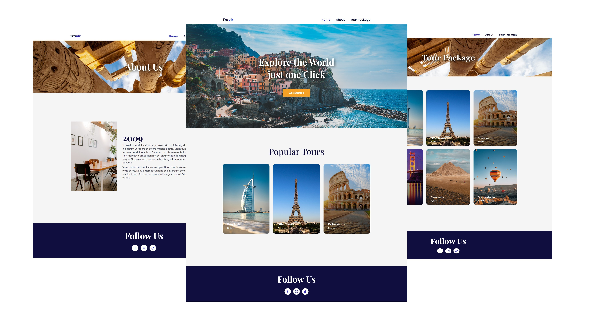

#

  

<h1 align="center"> React Responsive UI  </h1> 

 

&#160This project is a travel themed UI design. I used React for this project because it is one of the best tools to increase efficiency and speed. I often used the "Router" method.

 
<h2 align="center">Used Technologies </h2> 

 

Editor:&#160Visual Stuido Code

 

Tools:&#160React,Node

 
  
<h2 align="center">License </h2>

 

  <a href="https://choosealicense.com/licenses/mit/">MIT</a>

  
